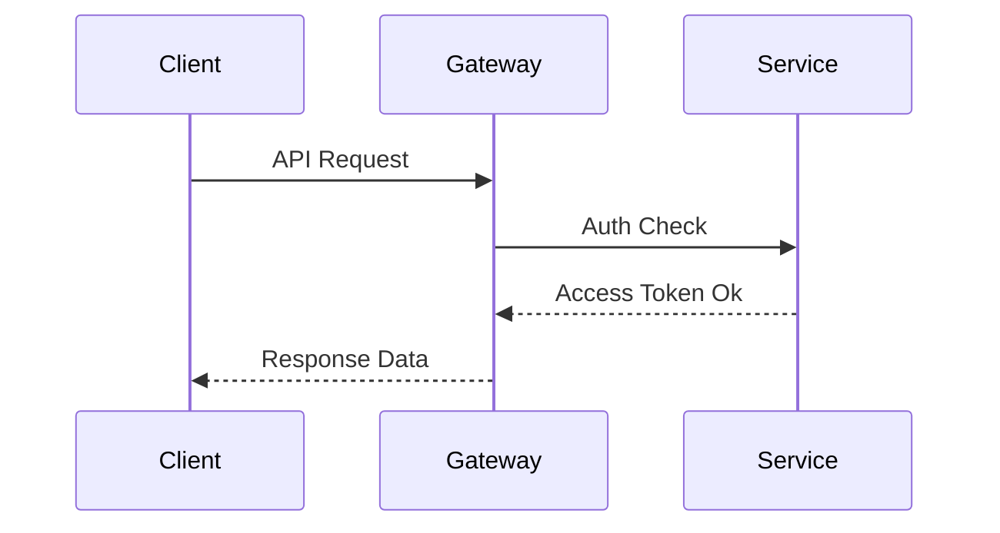

# RFC: [Feature/Architectural Change Name]

## Metadata
*   **Author(s):** [Your Name / GitHub Handle]
*   **Status:** Draft / Under Review / Approved
*   **Created at:** [Date]

---

## 📖 Summary
A high-level summary of the proposed changes. Keep it clear, concise, and accessible to general contributors.

## ❓ Problem Statement & Motivation
Why are we introducing this feature/change? What problem does it solve? What is the impact of not doing it?

## 📐 Proposed Design & Architecture
Detail the core design. Feel free to include:
*   Mermaid diagrams visualizing the flow or components.
*   Inter-service communication flow (e.g., REST, WebSockets, Kafka events).
*   Data schema changes (PostgreSQL / Elasticsearch mapping changes).



## 🔌 API & SDK Interface Specification
Specify changes to endpoints, payload formats, SDK functions, or exported interfaces. For example:
```typescript
interface SamplePayload {
  projectId: string;
  query: string;
}
```

## 🛠️ Implementation Plan
Break down the implementation into progressive phases or milestones.
1.  Phase 1: [e.g., Schema & DB Adapters]
2.  Phase 2: [e.g., Core Logic & AI Execution]
3.  Phase 3: [e.g., API Gateways & Frontend Dashboard]

## 🧪 Testing & Verification
How will we verify this feature?
*   Unit tests: [Files and functions to target]
*   Integration/E2E tests: [Scenario coverage]
*   Performance benchmarks (if applicable).

## ⚠️ Risks, Trade-offs & Open Questions
What are the known trade-offs or alternative designs considered? Are there open questions that need community input?
