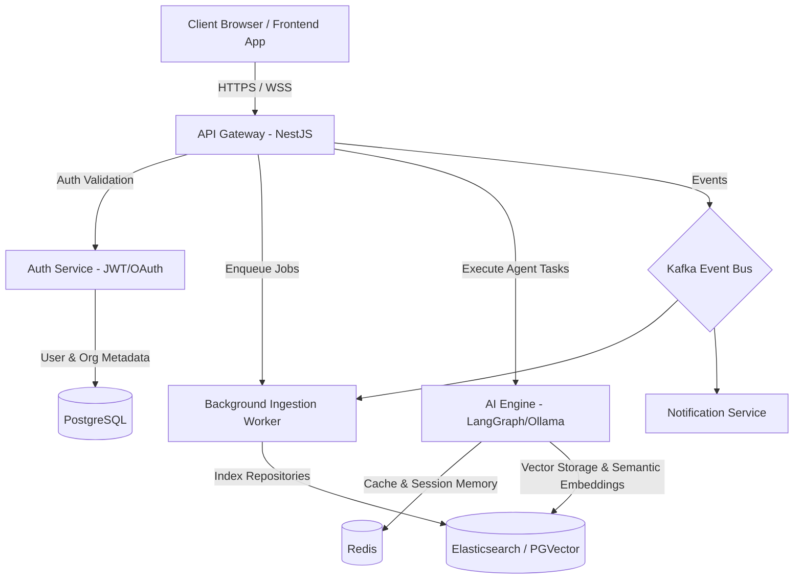

# 🚀 Awesome AI Platform

[]()
[](LICENSE)
[](CONTRIBUTING.md)
[](CODE_OF_CONDUCT.md)
[]()
[](https://udaysinghkushwah.github.io/awesome-ai-platform/)

**Hosted Interactive Dashboard:** [https://udaysinghkushwah.github.io/awesome-ai-platform/](https://udaysinghkushwah.github.io/awesome-ai-platform/)

> A Next-Generation Open Source AI Workspace and Agent Platform designed for developers. Think **GitHub + Cursor + Notion + Jira + Claude + Local AI** unified under one dashboard. Everything in your workspace becomes semantic, indexed, and queryable.

---

## 🗺️ System Architecture

Our platform is structured as a cloud-native, event-driven monorepo designed for high scalability, security, and modularity.



---

## 🛠️ Technology Stack

| Layer | Technology | Purpose |
|---|---|---|
| **Core Framework** | NestJS (Node.js, TypeScript) | API Gateway, Routing, and Service Orchestration |
| **Frontend** | Next.js 14 (React, TypeScript) | Premium, glassmorphic UI dashboard |
| **Databases** | PostgreSQL, Redis, Elasticsearch | Metadata storage, caching/session states, and full-text index |
| **AI Orchestration** | LangGraph & LangChain | Multi-agent execution and workflows |
| **AI Providers** | OpenAI, Gemini, Claude, Ollama | LLM Inference and Embedding generation |
| **Infrastructure** | Docker, Kubernetes, Kafka | Containerization, orchestration, and event-driven communication |
| **Observability** | Prometheus, Grafana, Jaeger, Loki | Application metrics, distributed tracing, and structured logging |

---

## 🌟 Key Features

### Phase 1: Foundation & Collaboration
*   **Multi-tenant Architecture**: Organization, Project, and Team level workspaces.
*   **Authentication & Access Control**: Secure JWT-based authentication with OAuth (GitHub, Google) and SAML support.
*   **GitHub Integration**: Connect repositories, list branches, and sync metadata.
*   **AI Chat & Prompt History**: Multi-turn conversation with global session memory.
*   **Plugin SDK**: Modular extension points for external developers.

### Phase 2: Ingestion & Search
*   **Semantic Search**: High-performance semantic search utilizing chunked text embeddings.
*   **Repository Indexing**: Auto-indexes source code files, docs, and pull requests.
*   **Auto Swagger/API Generator**: Generate Swagger documentation and boilerplate APIs using prompt contexts.

### Phase 3: AI-Powered Reviews & Scans
*   **PR Review Agent**: Automatic review of Pull Requests for security issues, complexity, and styling.
*   **SQL Analyzer**: Reads PostgreSQL schemas and slow query logs to provide optimization tips.

### Phase 4 & 5: Multi-Agent Marketplace
*   **Role-Based Agent Mesh**: Autonomous Architect, Dev, DevOps, and QA agents collaborating on tasks.
*   **Marketplace**: Upload, download, and configure custom extensions and plugins.

---

## 🚀 Quick Start (Development Setup)

### Prerequisites

*   **Node.js**: `v20.x` or later
*   **pnpm**: `v9.x` or later
*   **Docker & Docker Compose**

### Setup Environment

1.  Clone this repository and go to the project directory:
    ```bash
    git clone https://github.com/your-username/awesome-ai-platform.git
    cd awesome-ai-platform
    ```

2.  Install dependencies:
    ```bash
    pnpm install
    ```

3.  Configure local environment variables:
    ```bash
    cp .env.example .env
    ```

4.  Start local infrastructure (Postgres, Redis, Elasticsearch, Kafka):
    ```bash
    docker-compose up -d
    ```

5.  Run the developer environment:
    ```bash
    pnpm dev
    ```

---

## 📂 Repository Layout

```
awesome-ai-platform/
├── apps/
│   ├── gateway/         # API Gateway (NestJS)
│   ├── auth/            # Authentication service (OAuth, SAML)
│   ├── ai/              # LangGraph AI execution node
│   ├── worker/          # Data ingestion and background worker
│   ├── scheduler/       # Cron jobs and timed tasks
│   ├── search/          # Vector indexing & search controller
│   └── frontend/        # Web dashboard (Next.js)
├── packages/
│   ├── sdk/             # SDK for plugin developers
│   ├── shared/          # Types, interfaces, and common utilities
│   ├── logger/          # Monorepo logger system
│   ├── database/        # DB Clients (Postgres/Redis/Mongo config)
│   └── plugins/         # Loaded plugins library
├── docs/                # Architectural Decision Records (ADRs) & specs
└── examples/            # Example plugin configurations
```

---

## 🤝 Contributing

We welcome contributions of all levels! Please read our [Contributing Guidelines](CONTRIBUTING.md) and check out the `good first issue` tags in the repository issues tracker.

---

## 📄 License

This project is licensed under the MIT License - see the [LICENSE](LICENSE) file for details.

---

## ☕ Support

If you find this project helpful, support my work by buying me a chai!

[](https://www.buymeachai.in/toudaysinghkushwah)

